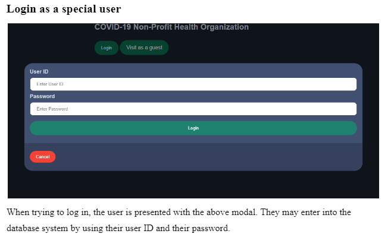
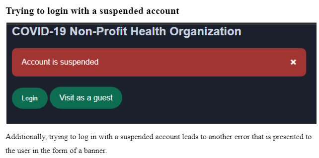
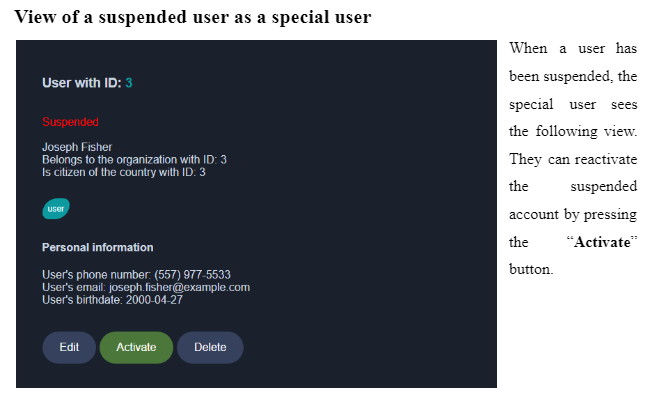
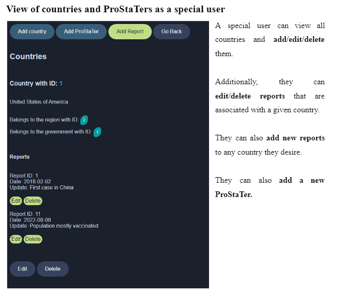

## About This Project

The current project is a web interface for a COVID-19 database containing users, articles, organizations and others.

- Login system with session saving and flushing
- Interaction with the ENCS database (modified by us) offered by Concordia University
- Different views depending on the user's statues (guest, normal user or special user)
- CRUD endpoints for all models and more (articles, users, organizations, countries, ProStaTers, reports, etc.)
- Cohesive UI between the different pages

### Frameworks and software used

- **Laravel**
- **PhpStorm**
- **ENCS database**
- **Web server hosted by ENCS Concordia University**

## Snapshots

## License

The Laravel framework is open-sourced software licensed under the [MIT license](https://opensource.org/licenses/MIT).
